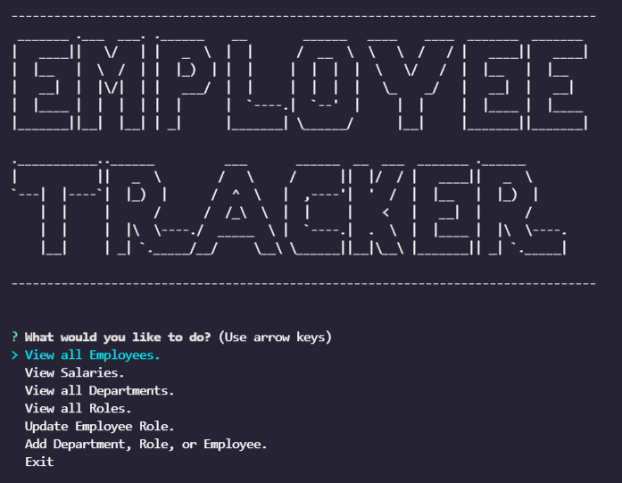

# Unit 12 MySQL Homework: Employee Tracker

## Description

Create an interface that allows a user to track their employees. The app will contain roles, departments, and salaries while tieing them together. The app will also allow the ability to add in additional fields o the mentioned categories.    

## Table of Contents
- [Description](#description)
- [Installation](#installation)
- [Usage](#usage)
- [License](#license)
- [Contributors](#contributors)
- [Tests](#tests)
- [Questions](#questions)
- [Contact](#contact)

## Installation

There are no files to download for this project.

The packages required to run are:

-Inquirer

-Mysql

-Figlet

-Consol.table 

## Usage

To start the app type in npm start in the CLI

When the program runs you'll be met with a variety of options.

You can view the three tables Role, Department, or Employee

Then if you need to you have the option to add to these tables. 
It will show you the current table for reference.

When you're done select exit to end the connection. 

## License

Source link for [MIT](https://opensource.org/licenses/MIT)

## Contributors

Cody Gallagher

## Tests

There are currently no tests for this application.  

## Questions

Certain queries need to have more security and there were instances where null will cause issues. 

## Contact

[GitHub Profile](https://github.com/CodyG-2021)

Email Me -- gallagher2021@gmail.com